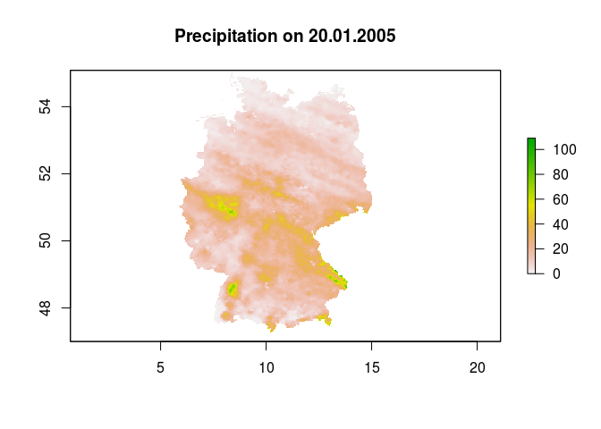
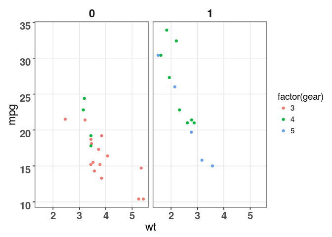

esmisc
======

`esmisc` is a R package containing misc functions of Eduard Szöcs.

Functions
---------

Currently the following functions are available:

-   `read_regnie()` reads DWD REGNIE data into R.
-   `theme_edi()` is a custom ggplot2 theme that I use.

Installation
------------

`esmisc` is currently only available on github. To install `esmisc` use:

    install.packages('devtools')
    library(devtools)
    install_github('esmisc', 'EDiLD')
    library(esmisc)

Examples
--------

    library(esmisc)

### Read DWD REGNIE data into R

    r <- read_regnie(system.file("extdata", "ra050120.gz", package = "esmisc"))
    # plot the raster
    require(raster)
    plot(r, main = 'Precipitation on 20.01.2005')

### ggplot2 theme

    library(ggplot2)
    p <- ggplot(mtcars) + 
      geom_point(aes(x = wt, y = mpg, colour = factor(gear))) + 
      facet_wrap(~am) + 
      theme_edi()
    p

### other functions

#### Geometric mean

    mean(c(1, 10, 100))

    ## [1] 37

    geomean(c(1, 10, 100))

    ## [1] 10
